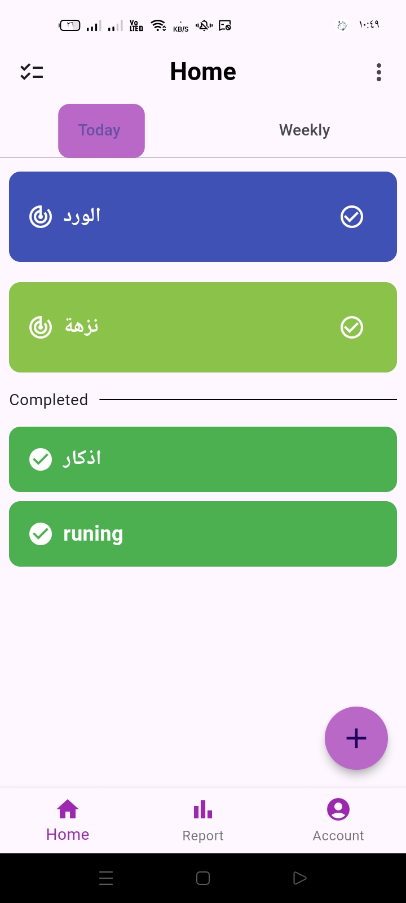
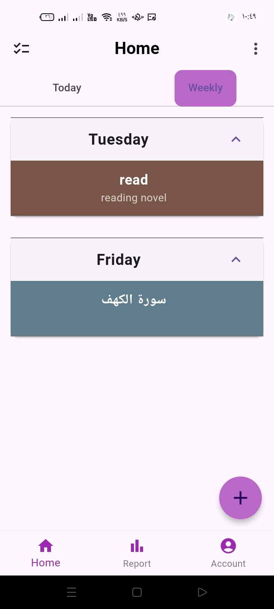

# HabitFlow

**HabitFlow** is a mobile application built with Flutter, designed to help users develop and maintain positive habits. The app focuses on providing a user-friendly experience to encourage habit formation, track daily progress, and support personal growth. It features an engaging onboarding experience, customizable habit settings, progress analytics, and much more.

## Screenshots



## Features

- **User Onboarding**: Step-by-step onboarding screens to guide new users through the app’s core functionalities.
- **Habit Tracking**: Create, edit, and delete habits with customizable settings (frequency, reminders, etc.).
- **User Dashboard**: Personalized dashboard displaying active habits, completion rates, and streaks.
- **Notifications**: Push notifications to keep users reminded of their habits.
- **Media Upload**: Option to upload image for your profile.

## Installation

To set up and run HabitFlow locally:

1. Clone the repository:
   ```bash
   git clone https://github.com/RehabNader003/HabitFlow-Flutter.git
   ```
2. Navigate into the project directory:
   ```bash
   cd HabitFlow-Flutter
   ```
3. Install dependencies:
   ```bash
   flutter pub get
   ```
4. Run the app on an emulator or connected device:
   ```bash
   flutter run
   ```

## Technologies Used

- **Flutter & Dart**: For building the mobile application.
- **Firebase**: Backend services for user authentication and data storage.
- **Provider**: State management for efficient handling of app state.

## Contributing

We welcome contributions to improve HabitFlow! To contribute:

1. Fork this repository.
2. Create a branch for your feature:
   ```bash
   git checkout -b feature/YourFeatureName
   ```
3. Commit your changes:
   ```bash
   git commit -m "Add a new feature"
   ```
4. Push to your branch:
   ```bash
   git push origin feature/YourFeatureName
   ```
5. Open a pull request.

- [Lab: Write your first Flutter app](https://docs.flutter.dev/get-started/codelab)
- [Cookbook: Useful Flutter samples](https://docs.flutter.dev/cookbook)

For help getting started with Flutter development, view the
[online documentation](https://docs.flutter.dev/), which offers tutorials,
samples, guidance on mobile development, and a full API reference.

---

**HabitFlow**: Start tracking your habits and make progress every day!
